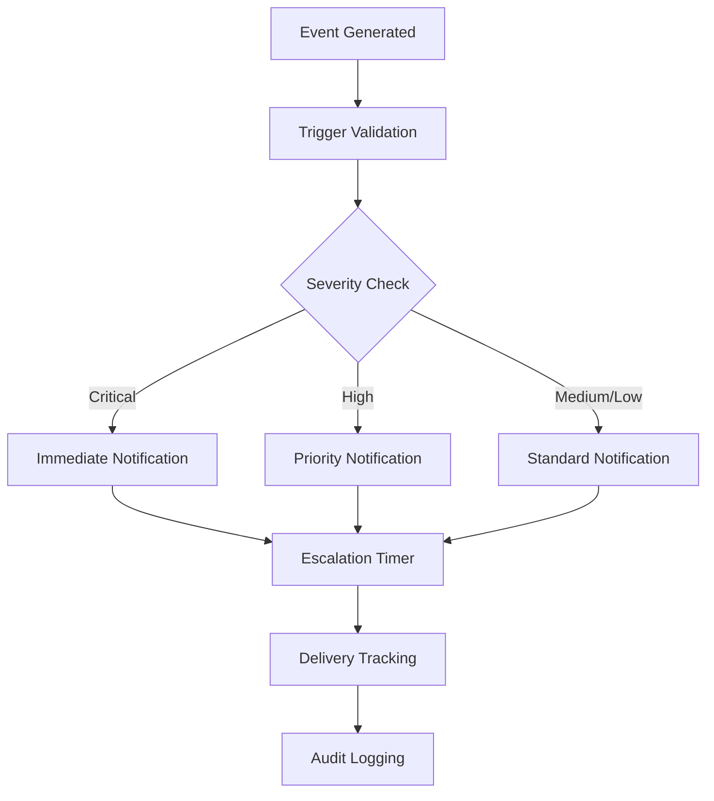

# PhishGuard Notification Flow Documentation

## Overview

PhishGuard's notification system is a critical component that ensures rapid communication of security threats to relevant stakeholders. This document outlines the comprehensive notification workflow, from threat detection to stakeholder alerting, including escalation procedures, notification channels, and compliance requirements.

## Table of Contents

- [Notification Architecture](#notification-architecture)
- [Notification Triggers](#notification-triggers)
- [Notification Channels](#notification-channels)
- [Escalation Procedures](#escalation-procedures)
- [Notification Templates](#notification-templates)
- [Stakeholder Management](#stakeholder-management)
- [Compliance and Audit](#compliance-and-audit)
- [Performance Metrics](#performance-metrics)
- [Troubleshooting](#troubleshooting)

## Notification Architecture

### System Components

```
┌─────────────────┐    ┌──────────────────┐    ┌─────────────────┐
│  Threat Engine  │───►│  Notification    │───►│  Channel        │
│                 │    │  Orchestrator    │    │  Dispatcher     │
└─────────────────┘    └──────────────────┘    └─────────────────┘
                                │                        │
                                ▼                        ▼
                       ┌──────────────────┐    ┌─────────────────┐
                       │  Template        │    │  Delivery       │
                       │  Engine          │    │  Tracking       │
                       └──────────────────┘    └─────────────────┘
```

### Core Services

- **Notification Service**: Central orchestration of all notifications
- **Template Engine**: Dynamic content generation for notifications
- **Channel Manager**: Multi-channel delivery coordination
- **Escalation Engine**: Automated escalation based on rules
- **Audit Logger**: Comprehensive notification tracking

## Notification Triggers

### Primary Triggers

#### 1. Threat Detection Events
```json
{
  "trigger_type": "threat_detected",
  "severity": "high|medium|low|critical",
  "threat_type": "phishing|malware|spam|bec",
  "confidence_score": 0.85,
  "affected_users": ["user@company.com"],
  "detection_time": "2024-10-18T14:30:25Z"
}
```

#### 2. System Health Events
```json
{
  "trigger_type": "system_health",
  "event": "service_down|performance_degraded|storage_full",
  "component": "api_server|ai_engine|database",
  "severity": "critical|warning|info",
  "metrics": {
    "cpu_usage": 95,
    "memory_usage": 87,
    "disk_usage": 92
  }
}
```

#### 3. Security Events
```json
{
  "trigger_type": "security_event",
  "event": "unauthorized_access|brute_force|data_breach",
  "source_ip": "192.168.1.100",
  "user_agent": "Mozilla/5.0...",
  "affected_resources": ["quarantine_storage", "user_data"]
}
```

#### 4. Compliance Events
```json
{
  "trigger_type": "compliance_event",
  "regulation": "gdpr|sox|hipaa",
  "event": "data_request|retention_expiry|audit_required",
  "deadline": "2024-10-25T23:59:59Z"
}
```

### Trigger Processing Flow



## Notification Channels

### 1. Email Notifications

#### Configuration
```python
EMAIL_CONFIG = {
    "smtp_host": "smtp.company.com",
    "smtp_port": 587,
    "encryption": "tls",
    "authentication": "oauth2",
    "rate_limit": "100/minute",
    "retry_attempts": 3,
    "retry_delay": "exponential_backoff"
}
```

#### Email Types
- **Security Alerts**: High-priority threat notifications
- **Daily Summaries**: Aggregated threat intelligence reports
- **System Status**: Health and performance updates
- **Compliance Reports**: Regulatory and audit notifications

### 2. Slack Integration

#### Webhook Configuration
```json
{
  "webhook_url": "https://hooks.slack.com/services/...",
  "channels": {
    "security_alerts": "#security-team",
    "system_status": "#devops",
    "compliance": "#compliance-team"
  },
  "mention_groups": {
    "critical": "@security-oncall",
    "high": "@security-team",
    "medium": "@channel"
  }
}
```

#### Message Templates
```python
SLACK_TEMPLATES = {
    "threat_alert": {
        "color": "danger",
        "title": "🚨 PhishGuard Threat Alert",
        "fields": [
            {"title": "Threat Type", "value": "{threat_type}", "short": True},
            {"title": "Confidence", "value": "{confidence}%", "short": True},
            {"title": "Affected Users", "value": "{user_count}", "short": True}
        ],
        "actions": [
            {"text": "View Details", "url": "{details_url}"},
            {"text": "Quarantine", "value": "quarantine_action"}
        ]
    }
}
```

### 3. Microsoft Teams Integration

#### Teams Connector
```json
{
  "connector_url": "https://outlook.office.com/webhook/...",
  "card_format": "adaptive_card",
  "teams": ["Security Team", "IT Operations"],
  "notification_types": ["alerts", "reports", "system_status"]
}
```

### 4. SMS/Push Notifications

#### Critical Alert Configuration
```python
SMS_CONFIG = {
    "provider": "twilio",
    "api_key": "encrypted_api_key",
    "sender_number": "+1234567890",
    "rate_limit": "10/hour",
    "emergency_contacts": [
        "+1555123456",  # Security Manager
        "+1555789012"   # IT Director
    ]
}
```

### 5. SIEM Integration

#### Syslog Format
```
<Priority>Timestamp Hostname PhishGuard[PID]: [THREAT_ID] Severity=HIGH Type=PHISHING User=user@company.com Confidence=0.92 Action=QUARANTINED
```

#### CEF Format
```
CEF:0|PhishGuard|Email Security|1.0|PHISH_DETECTED|Phishing Email Detected|8|src=192.168.1.100 dst=mail.company.com suser=attacker@malicious.com duser=victim@company.com msg=Credential harvesting attempt detected
```

## Escalation Procedures

### Escalation Matrix

| Severity | Initial Notification | Escalation 1 (15 min) | Escalation 2 (30 min) | Escalation 3 (60 min) |
|----------|---------------------|----------------------|----------------------|----------------------|
| Critical | Security Team + Manager | IT Director + CISO | Executive Team | External Support |
| High | Security Team | Security Manager | IT Director | CISO |
| Medium | Security Analyst | Security Team Lead | Security Manager | - |
| Low | Security Dashboard | Daily Report | Weekly Summary | - |

### Escalation Rules Engine

```python
ESCALATION_RULES = {
    "threat_detected": {
        "critical": {
            "initial": ["security_team", "security_manager"],
            "escalation_1": {"delay": 900, "recipients": ["it_director", "ciso"]},
            "escalation_2": {"delay": 1800, "recipients": ["executive_team"]},
            "channels": ["email", "sms", "slack", "teams"]
        },
        "high": {
            "initial": ["security_team"],
            "escalation_1": {"delay": 900, "recipients": ["security_manager"]},
            "escalation_2": {"delay": 3600, "recipients": ["it_director"]},
            "channels": ["email", "slack"]
        }
    },
    "system_down": {
        "critical": {
            "initial": ["devops_team", "it_manager"],
            "escalation_1": {"delay": 300, "recipients": ["it_director"]},
            "escalation_2": {"delay": 900, "recipients": ["cto"]},
            "channels": ["email", "sms", "slack", "pagerduty"]
        }
    }
}
```

### Acknowledgment Tracking

```python
class EscalationTracker:
    def __init__(self, notification_id: str):
        self.notification_id = notification_id
        self.acknowledgments = []
        self.escalation_level = 0
        
    def acknowledge(self, user_id: str, timestamp: datetime):
        """Record acknowledgment and stop escalation if criteria met"""
        self.acknowledgments.append({
            "user_id": user_id,
            "timestamp": timestamp,
            "escalation_level": self.escalation_level
        })
        
        if self.should_stop_escalation():
            self.stop_escalation()
    
    def should_stop_escalation(self) -> bool:
        """Check if escalation should stop based on acknowledgment rules"""
        required_acks = ESCALATION_RULES[self.event_type]["required_acknowledgments"]
        recent_acks = [ack for ack in self.acknowledgments 
                      if ack["timestamp"] > datetime.now() - timedelta(minutes=5)]
        return len(recent_acks) >= required_acks
```

## Notification Templates

### Dynamic Template System

#### Template Structure
```python
NOTIFICATION_TEMPLATES = {
    "phishing_alert": {
        "email": {
            "subject": "🚨 PhishGuard Alert: {threat_type} detected from {sender}",
            "template_file": "templates/email/phishing_alert.html",
            "variables": ["threat_type", "sender", "confidence", "details_url"]
        },
        "slack": {
            "template_file": "templates/slack/phishing_alert.json",
            "variables": ["threat_type", "sender", "confidence", "quarantine_url"]
        }
    }
}
```

#### Email Template Example
```html
<!DOCTYPE html>
<html>
<head>
    <title>PhishGuard Security Alert</title>
    <style>
        .alert-critical { background-color: #d32f2f; color: white; }
        .alert-high { background-color: #f57c00; color: white; }
        .alert-medium { background-color: #1976d2; color: white; }
    </style>
</head>
<body>
    <div class="alert-{{severity}}">
        <h1>🛡️ PhishGuard Security Alert</h1>
        <h2>{{threat_type}} Detected</h2>
    </div>
    
    <div class="content">
        <h3>Threat Details</h3>
        <table>
            <tr><td><strong>Threat Type:</strong></td><td>{{threat_type}}</td></tr>
            <tr><td><strong>Sender:</strong></td><td>{{sender}}</td></tr>
            <tr><td><strong>Confidence:</strong></td><td>{{confidence}}%</td></tr>
            <tr><td><strong>Detection Time:</strong></td><td>{{detection_time}}</td></tr>
            <tr><td><strong>Affected Users:</strong></td><td>{{affected_users|length}}</td></tr>
        </table>
        
        <h3>Recommended Actions</h3>
        <ul>
            <li>Review quarantined email details</li>
            <li>Notify affected users if necessary</li>
            <li>Update security awareness training</li>
            <li>Consider blocking sender domain</li>
        </ul>
        
        <div class="actions">
            <a href="{{quarantine_url}}" class="button">View Quarantined Email</a>
            <a href="{{dashboard_url}}" class="button">Open Dashboard</a>
        </div>
    </div>
    
    <div class="footer">
        <p>This alert was generated by PhishGuard at {{generation_time}}</p>
        <p>Alert ID: {{alert_id}} | Confidence: {{confidence}}%</p>
    </div>
</body>
</html>
```

### Template Personalization

```python
class NotificationPersonalizer:
    def personalize_content(self, template: str, user: User, context: dict) -> str:
        """Personalize notification content based on user preferences and context"""
        
        # User-specific customizations
        if user.preferred_language != 'en':
            template = self.translate_template(template, user.preferred_language)
        
        # Role-based content filtering
        if user.role == 'executive':
            context['details_level'] = 'summary'
        elif user.role == 'analyst':
            context['details_level'] = 'detailed'
        
        # Timezone adjustments
        for key, value in context.items():
            if isinstance(value, datetime):
                context[key] = value.astimezone(user.timezone)
        
        return self.render_template(template, context)
```

## Stakeholder Management

### Stakeholder Categories

#### 1. Security Team
```python
SECURITY_TEAM = {
    "roles": ["security_analyst", "security_engineer", "security_manager"],
    "notification_preferences": {
        "channels": ["email", "slack"],
        "frequency": "immediate",
        "detail_level": "full"
    },
    "escalation_threshold": {
        "auto_escalate_after": 900,  # 15 minutes
        "escalate_to": "security_manager"
    }
}
```

#### 2. IT Operations
```python
IT_OPERATIONS = {
    "roles": ["sysadmin", "devops", "it_manager"],
    "notification_preferences": {
        "channels": ["email", "slack", "pagerduty"],
        "frequency": "system_events_only",
        "detail_level": "technical"
    },
    "on_call_schedule": {
        "primary": "rotating_schedule",
        "backup": "manager_escalation"
    }
}
```

#### 3. Executive Team
```python
EXECUTIVE_TEAM = {
    "roles": ["ciso", "cto", "ceo"],
    "notification_preferences": {
        "channels": ["email", "sms"],
        "frequency": "critical_only",
        "detail_level": "executive_summary"
    },
    "escalation_triggers": {
        "data_breach": "immediate",
        "system_compromise": "immediate",
        "compliance_violation": "within_1_hour"
    }
}
```

### Contact Management

```python
class ContactManager:
    def __init__(self):
        self.contacts = {}
        self.schedules = {}
    
    def get_notification_recipients(self, event_type: str, severity: str) -> List[Contact]:
        """Determine who should receive notifications based on event and severity"""
        recipients = []
        
        # Get base recipients from event type
        base_recipients = NOTIFICATION_RULES[event_type]["recipients"]
        
        # Filter by severity
        for recipient in base_recipients:
            if self.should_notify(recipient, severity):
                recipients.append(recipient)
        
        # Add on-call personnel for critical events
        if severity == "critical":
            recipients.extend(self.get_on_call_contacts())
        
        return recipients
    
    def get_on_call_contacts(self) -> List[Contact]:
        """Get current on-call personnel"""
        current_time = datetime.now()
        on_call = []
        
        for schedule in self.schedules.values():
            if schedule.is_on_call(current_time):
                on_call.extend(schedule.get_current_contacts())
        
        return on_call
```

## Compliance and Audit

### Regulatory Requirements

#### GDPR Compliance
```python
GDPR_NOTIFICATION_REQUIREMENTS = {
    "data_breach": {
        "authority_notification": {
            "deadline": "72_hours",
            "recipients": ["data_protection_authority"],
            "required_fields": [
                "nature_of_breach",
                "categories_of_data",
                "number_of_individuals",
                "likely_consequences",
                "measures_taken"
            ]
        },
        "individual_notification": {
            "threshold": "high_risk_to_individuals",
            "deadline": "without_undue_delay",
            "method": "direct_communication"
        }
    }
}
```

#### SOX Compliance
```python
SOX_NOTIFICATION_REQUIREMENTS = {
    "financial_data_access": {
        "immediate_notification": ["audit_committee", "external_auditor"],
        "documentation_required": True,
        "retention_period": "7_years"
    },
    "system_changes": {
        "advance_notification": "48_hours",
        "approval_required": True,
        "change_log_update": "automatic"
    }
}
```

### Audit Trail

```python
class NotificationAuditor:
    def log_notification(self, notification: Notification) -> str:
        """Create comprehensive audit log entry for notification"""
        audit_entry = {
            "notification_id": notification.id,
            "timestamp": datetime.utcnow().isoformat(),
            "event_type": notification.event_type,
            "severity": notification.severity,
            "recipients": [r.email for r in notification.recipients],
            "channels": notification.channels,
            "template_used": notification.template_id,
            "delivery_status": notification.delivery_status,
            "acknowledgments": notification.acknowledgments,
            "escalation_level": notification.escalation_level,
            "compliance_flags": notification.compliance_flags
        }
        
        # Store in audit database
        audit_id = self.store_audit_entry(audit_entry)
        
        # Generate compliance hash for integrity verification
        audit_entry["integrity_hash"] = self.generate_integrity_hash(audit_entry)
        
        return audit_id
```

## Performance Metrics

### Key Performance Indicators

#### Notification Delivery Metrics
```python
NOTIFICATION_METRICS = {
    "delivery_time": {
        "target": "< 30 seconds",
        "measurement": "time_from_trigger_to_delivery",
        "sla": "95th_percentile_under_target"
    },
    "delivery_success_rate": {
        "target": "> 99.5%",
        "measurement": "successful_deliveries / total_attempts",
        "exclusions": ["recipient_unavailable", "channel_maintenance"]
    },
    "acknowledgment_rate": {
        "target": "> 90%",
        "measurement": "acknowledged_notifications / critical_notifications",
        "time_window": "within_15_minutes"
    }
}
```

#### System Performance Metrics
```python
SYSTEM_METRICS = {
    "notification_queue_depth": {
        "warning_threshold": 1000,
        "critical_threshold": 5000,
        "auto_scaling_trigger": 2000
    },
    "channel_availability": {
        "target": "> 99.9%",
        "measurement": "channel_uptime / total_time",
        "per_channel_monitoring": True
    },
    "template_rendering_time": {
        "target": "< 5 seconds",
        "measurement": "template_processing_duration",
        "complex_template_allowance": "< 15 seconds"
    }
}
```

### Performance Monitoring

```python
class NotificationMetricsCollector:
    def __init__(self):
        self.metrics_store = MetricsStore()
        self.alert_thresholds = NOTIFICATION_METRICS
    
    def record_delivery_metrics(self, notification: Notification):
        """Record delivery performance metrics"""
        delivery_time = notification.delivered_at - notification.created_at
        
        self.metrics_store.record_metric(
            metric_name="notification_delivery_time",
            value=delivery_time.total_seconds(),
            tags={
                "severity": notification.severity,
                "channel": notification.primary_channel,
                "event_type": notification.event_type
            }
        )
        
        # Check SLA compliance
        if delivery_time.total_seconds() > 30:
            self.alert_sla_violation("delivery_time", notification)
    
    def generate_performance_report(self, time_range: str) -> dict:
        """Generate comprehensive performance report"""
        return {
            "delivery_metrics": self.get_delivery_metrics(time_range),
            "channel_performance": self.get_channel_performance(time_range),
            "escalation_analytics": self.get_escalation_analytics(time_range),
            "user_engagement": self.get_user_engagement_metrics(time_range),
            "sla_compliance": self.get_sla_compliance(time_range)
        }
```

## Troubleshooting

### Common Issues and Solutions

#### 1. Email Delivery Failures
```python
EMAIL_TROUBLESHOOTING = {
    "smtp_connection_failed": {
        "symptoms": ["Connection timeout", "Authentication failure"],
        "solutions": [
            "Verify SMTP server settings",
            "Check firewall rules",
            "Validate credentials",
            "Test from different network"
        ],
        "escalation": "notify_it_operations"
    },
    "high_bounce_rate": {
        "symptoms": ["Bounce rate > 5%", "Invalid email addresses"],
        "solutions": [
            "Clean email distribution lists",
            "Implement email validation",
            "Check sender reputation",
            "Review content for spam triggers"
        ],
        "prevention": "regular_list_maintenance"
    }
}
```

#### 2. Slack Integration Issues
```python
SLACK_TROUBLESHOOTING = {
    "webhook_failures": {
        "symptoms": ["HTTP 404/403 errors", "Messages not appearing"],
        "solutions": [
            "Verify webhook URL validity",
            "Check channel permissions",
            "Regenerate webhook if necessary",
            "Test with minimal payload"
        ],
        "monitoring": "webhook_health_check"
    },
    "rate_limiting": {
        "symptoms": ["HTTP 429 errors", "Delayed message delivery"],
        "solutions": [
            "Implement exponential backoff",
            "Reduce message frequency",
            "Batch non-critical notifications",
            "Use Slack's recommended patterns"
        ],
        "prevention": "rate_limit_monitoring"
    }
}
```

#### 3. Performance Issues
```python
PERFORMANCE_TROUBLESHOOTING = {
    "slow_notification_delivery": {
        "symptoms": ["Delivery time > 30 seconds", "Queue backup"],
        "investigation_steps": [
            "Check system resource usage",
            "Monitor database query performance",
            "Analyze template rendering time",
            "Review network connectivity"
        ],
        "solutions": [
            "Scale notification workers",
            "Optimize database queries",
            "Cache rendered templates",
            "Implement async processing"
        ]
    },
    "high_memory_usage": {
        "symptoms": ["Memory usage > 80%", "Out of memory errors"],
        "solutions": [
            "Implement notification batching",
            "Optimize template caching",
            "Add memory monitoring",
            "Scale infrastructure"
        ]
    }
}
```

### Diagnostic Tools

```python
class NotificationDiagnostics:
    def run_health_check(self) -> dict:
        """Comprehensive health check of notification system"""
        return {
            "channel_connectivity": self.test_all_channels(),
            "template_rendering": self.test_template_rendering(),
            "database_connectivity": self.test_database_connection(),
            "queue_status": self.check_queue_health(),
            "external_dependencies": self.test_external_services()
        }
    
    def test_notification_delivery(self, test_type: str = "end_to_end"):
        """Send test notifications to verify delivery pipeline"""
        test_notification = self.create_test_notification(test_type)
        
        start_time = time.time()
        delivery_result = self.send_test_notification(test_notification)
        end_time = time.time()
        
        return {
            "delivery_time": end_time - start_time,
            "success": delivery_result.success,
            "errors": delivery_result.errors,
            "channel_results": delivery_result.channel_results
        }
```

## Integration Examples

### Custom Notification Handler

```python
from phishguard.notifications import NotificationService, NotificationChannel

class CustomNotificationHandler:
    def __init__(self):
        self.notification_service = NotificationService()
        
    def handle_threat_detection(self, threat_event: dict):
        """Handle new threat detection with custom logic"""
        
        # Determine severity and recipients
        severity = self.calculate_severity(threat_event)
        recipients = self.get_recipients_for_threat(threat_event, severity)
        
        # Create notification
        notification = self.notification_service.create_notification(
            event_type="threat_detected",
            severity=severity,
            recipients=recipients,
            template="phishing_alert",
            context=threat_event
        )
        
        # Add custom channels if needed
        if threat_event.get("threat_type") == "ransomware":
            notification.add_channel("sms")  # Immediate SMS for ransomware
        
        # Send notification
        return self.notification_service.send(notification)
```

---

## Configuration Reference

### Environment Variables

```bash
# Notification Service Configuration
NOTIFICATION_SERVICE_ENABLED=true
NOTIFICATION_QUEUE_SIZE=10000
NOTIFICATION_WORKER_COUNT=5
NOTIFICATION_RETRY_ATTEMPTS=3

# Email Configuration
SMTP_HOST=smtp.company.com
SMTP_PORT=587
SMTP_USE_TLS=true
SMTP_USERNAME=phishguard@company.com
SMTP_PASSWORD=encrypted_password
EMAIL_RATE_LIMIT=100

# Slack Configuration
SLACK_WEBHOOK_URL=https://hooks.slack.com/services/...
SLACK_RATE_LIMIT=1
SLACK_TIMEOUT=10

# Teams Configuration
TEAMS_WEBHOOK_URL=https://outlook.office.com/webhook/...
TEAMS_RATE_LIMIT=5
TEAMS_TIMEOUT=15

# SMS Configuration
SMS_PROVIDER=twilio
SMS_ACCOUNT_SID=encrypted_sid
SMS_AUTH_TOKEN=encrypted_token
SMS_FROM_NUMBER=+1234567890
SMS_RATE_LIMIT=10

# Escalation Configuration
ESCALATION_ENABLED=true
ESCALATION_CHECK_INTERVAL=300
ACKNOWLEDGMENT_TIMEOUT=900
```

This comprehensive notification flow documentation provides enterprise-grade guidance for implementing and managing PhishGuard's notification system, ensuring rapid and reliable communication of security threats while maintaining compliance and audit requirements.